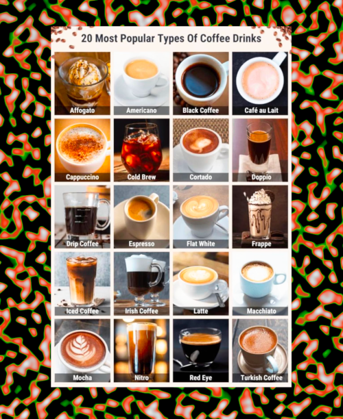

# CMPSC301 Data Science

Activity 05: Coffee Deserts and Oases (Mapping with `ggplot2` and `plotly`)

## Assigned and Due

- **Assigned**: Wednesday, 7th October 2026

- **Due and Expiration**: Monday, 12th October 2026 by class time.

Note: the expiration date is the last date you can submit your work for a grade.

<center>



</center>

## Table of Contents
- [CMPSC301 Data Science](#cmpsc301-data-science)
  - [Assigned and Due](#assigned-and-due)
  - [Table of Contents](#table-of-contents)
  - [Overview](#overview)
  - [Learning Objectives](#learning-objectives)
  - [Activity Goals](#activity-goals)
  - [Instructions](#instructions)
    - [Setting Up R (Do This First!)](#setting-up-r-do-this-first)
    - [Working the Script](#working-the-script)
    - [The Shiny App](#the-shiny-app)
  - [Deliverable](#deliverable)
  - [Submission](#submission)
  - [GatorGrade](#gatorgrade)
  - [Seeking Assistance](#seeking-assistance)
    - [Common Issues and Solutions](#common-issues-and-solutions)
  - [Learning Extensions (Optional)](#learning-extensions-optional)

Another note: parts of this activity were completed using Claude,
such as the formatting of this `README.md` file.

## Overview

Where can you grab a latte, and where would you walk for twenty minutes and
find nothing but a vending machine? In this 60-minute activity you will make
maps of coffee shops in a small, **fictional** college town (the coordinates
sit in a State College, PA sized box, but every shop and landmark is made
up). You will start with a script that is full of bugs, fix them one at a
time, and then use your working maps to hunt for **coffee oases** (places
where shops pile up) and **coffee deserts** (places with no coffee at all).

Here, you will practice reading R error messages, fixing common coding
mistakes (spelling, capitalization, punctuation, and missing arguments),
and drawing maps with `ggplot()` and `plotly`. Then you will explore a
finished Shiny app that measures how far you would have to walk to the nearest
coffee shop.

Spoiler Alert: a map is only as honest as the choices behind it (cell size,
cutoffs, and what data you left out). Dun-Da-Da!


## Learning Objectives

By completing this activity, you will be able to:

1. **Debug R code** - use error messages and hints to fix misspelled names, wrong capitalization, misplaced punctuation, and missing arguments
2. **Map point data** - plot longitude and latitude with `ggplot()` and `coord_quickmap()`
3. **Summarize spatial data** - use `group_by()`, `summarize()`, and `count()` to compare neighborhoods and grid cells
4. **Classify places** - use `case_when()` to label map cells as deserts, typical, or oases
5. **Read a map critically** - explain what a map shows, what it hides, and how your choices change the story


## Activity Goals

This activity has three parts:

- **Part 1: Fix the Bugs (about 25 minutes)** - `src/coffee_maps.R` contains 10 bugs. Each bug has a numbered comment with the error message you will see and a hint.
- **Part 2: Study the Maps (about 20 minutes)** - once the script runs, use the density map, zone map, interactive map, and the made-up city maps (Part 8 of the script, with roads and buildings) to answer the reflection questions.
- **Part 3: Play with the Shiny App (about 15 minutes)** - `shiny_app/app.R` is already finished. Use it to answer the last two reflection questions.

The data live in `data/`:

| File | What is in it |
| --- | --- |
| `coffee_shops.csv` | 215 shops: `shop_id`, `name`, `lon`, `lat`, `rating`, `chain_type`, `neighborhood` |
| `landmarks.csv` | 8 places (campus, hospital, homes, and so on): `landmark`, `type`, `lon`, `lat` |


## Instructions

### Setting Up R (Do This First!)

**IMPORTANT:** Install the packages once before starting:

```r
install.packages(c("tidyverse", "plotly", "shiny"))
```

Note: no other project setup (no `uv`, no virtual environment) is required for R.
Also, open the **activity folder** as your RStudio project or working directory
so paths such as `data/coffee_shops.csv` work. You can check with `getwd()`.

### Working the Script

*As you write your code, please refer to this week's slides on `ggplot()`, `plotly`, and the tidyverse.*

1. **Open** `src/coffee_maps.R` in RStudio and add your name at the top.
2. **Run** the script one line (or one plot block) at a time (`Ctrl+Enter` / `Cmd+Return`).
3. **Read** the error message when R complains. Find the bug comment (`Bug 1` to `Bug 10`) that matches it, and read the hint.
4. **Fix** the code and rerun it. Once it works, **delete** the bug comment and its hint, including the `TODO`.
5. **Look** at each map after it draws. Ask yourself what the map says about where coffee is (and is not).
6. **Answer** Part A and Part B of `writing/reflection.md` as you go.

There are 10 bugs and they are in order, so you will meet them one by one.
Some bugs are simple typos; others hide in plain sight!

### The Shiny App

Once your maps work, open `shiny_app/app.R` in RStudio and click **Run App**
(or run `shiny::runApp("shiny_app")` from the activity folder).

The app measures the walking time from every spot on the map to the nearest
coffee shop. Move the sliders to see which places are "served" and which are
"underserved."

- Choose the **longest walk** you will accept (3 to 30 minutes)
- Keep only shops with a minimum **rating**
- Count only certain **shop types** (national chains, regional chains, independents)
- Read the summary table and the landmark table to see who is left out
- Click **Show Code** at any time to reveal the R code behind the map and tables

Then answer Part C of `writing/reflection.md`.


## Deliverable

You will submit:

- Completed `src/coffee_maps.R` with all 10 bugs fixed and all `TODO` comments removed
- Completed `writing/reflection.md` with answers to all 11 questions (3 conceptual, 6 critical thinking, and 2 Shiny app questions)

**Note:** You do NOT need to submit screenshots of your maps. Your instructor will verify functionality by running your code.

## Submission

**This is a check mark grade.**

Please submit this assignment by pushing your work to your GitHub repository.
Ensure that:

- All bugs are fixed and all TODO comments have been removed
- The script runs from top to bottom without errors
- The reflection document is complete
- Your name has been added to both files

Use meaningful commit messages that describe what you accomplished:

```bash
git add .
git commit -m "Fix bugs 1-5: loading data and first maps"
git push
```


## GatorGrade

You can check your work by running GatorGrade:

```bash
gatorgrade --config config/gatorgrade.yml
```

This will verify that:

- All required files exist
- TODO items have been removed
- Your script runs without errors
- Reflection questions have been answered


## Seeking Assistance

If you encounter difficulties: Clear your work space using the code given below.

The top of `src/coffee_maps.R` already removes all left-over variables and
plots from previous runs. This ensures that you are performing a "clean run"
of your program each time.

```R
# Clear environment and plots
rm(list = ls()) # clear all variables
graphics.off()  # clear all plots
cat("\014")    # clear the console
```

1. **Read the error message carefully** - R tells you the function or object it could not find
2. **Check the hint** - each bug has one right above the code
3. **Look at the line BEFORE the error** - a missing comma or `+` is often reported on the next line
4. **Consult the documentation** - https://ggplot2.tidyverse.org/ and https://www.tidyverse.org/
5. **Ask during class or office hours** - bring specific questions about what you've tried
6. **Work with classmates** - discuss the bugs together, but write your own answers

### Common Issues and Solutions

**Issue:** `could not find function` error

- **Solution:** Check the spelling and capitalization of the function, and make sure the package is loaded with `library()`.

**Issue:** `object '...' not found`

- **Solution:** R is case sensitive. Compare your spelling against `glimpse(shops)` or `names(shops)`.

**Issue:** `'data/...' does not exist`

- **Solution:** Check `getwd()`. It should end in the activity folder name. Also check the capitalization of the file name in the `data/` folder.

**Issue:** The map looks squished or stretched

- **Solution:** Make sure `coord_quickmap()` is part of your plot.

**Issue:** The Shiny app says it cannot find `data/coffee_shops.csv`

- **Solution:** Run the app from the activity folder (`shiny::runApp("shiny_app")`), not from inside `shiny_app/`.


## Learning Extensions (Optional)

Looking for an extra challenge? After completing the required parts, challenge yourself with the following!

1. **Change the cell size** - in Part 6, use `round(lon * 50)` (cells about 2 km wide) and see how the number of deserts changes
2. **Chain vs. independent map** - make a map of only the `"Independent"` shops using `filter()`, and compare its oases to the map of National chains
3. **Rating heat map** - use `group_by()` on grid cells and `summarize(avg_rating = mean(rating))` to find the best-rated parts of town
4. **Combine what you've learned** - propose one new question about a city of your choice that could be answered with a map of points, and sketch the `ggplot()` code you would use (you don't have to run it)


**Remember:** The goal is not just to draw the map, but to build the habit of
asking "what does this map show, what does it hide, and would I make a
different decision if I had drawn it a different way?" *But you already know
all this, right!?*

Now, go do data science!!
